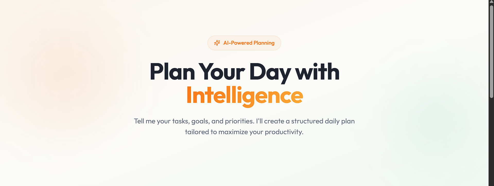
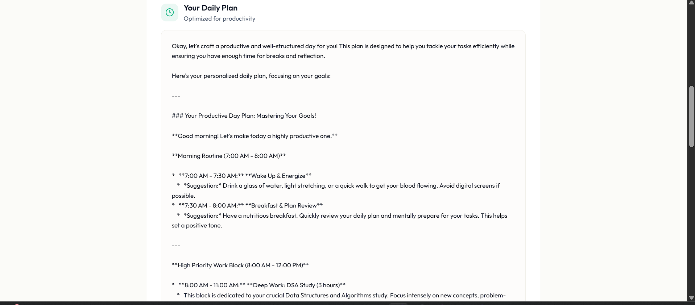

# 🌠 DayPilot – AI Daily Planner & Task Generator

An interactive web app that lets users **generate personalized daily to-do lists, schedule tasks, and receive productivity tips** — all powered by **Google’s Gemini API**.  

This website features a clean UI, input controls for goals/tasks, a “Generate Plan” button, an AI-powered output panel, and optional screenshots or demo videos — all designed to help users plan their day efficiently.  

---

## 🎯 Project Objective

To create a **fully interactive, front-end web app** that allows users to **generate structured daily plans** instantly using AI — without any backend, using only **HTML, CSS, and JavaScript**.  

---

## 🚀 Live Demo

🔗 [Visit the Website](https://day-pilot-tangerine.lovable.app/)  

---

## 🖥️ Tech Stack

- HTML5 + CSS3 + JavaScript (ES6)  
- Modular front-end structure for maintainability  
- **Google Gemini API** via AI Studio for AI-generated daily plans  
- Fully responsive, mobile-first design  
- No backend required  

---

## 🌟 Features

### *QuickPlan*
- 📝 Enter daily goals or tasks  
- Click **Generate Plan** to get a structured schedule  
- AI generates **priority tasks, estimated time blocks, and productivity tips**  

### *SmartBreaks*  
- ⏱️ Suggested break times to maximize focus  
- Reduces decision fatigue and keeps the user on track  

### *ProductivityTips*  
- 💡 Quick actionable tips based on tasks  
- Helps users improve efficiency and organization  

### *User-Friendly Interface*  
- ✨ Clean and simple UI for desktop and mobile  
- Output panel displays AI-generated plan clearly  
- Option to copy or save the plan  

---

## 📸 Screenshots / Demo Video

### Landing / Input Page

### AI Generated Plan

### Optional Demo Video
[Watch Demo on YouTube](https://www.youtube.com/watch?v=YOUR_VIDEO_LINK)

---

## 📁 Folder Structure

